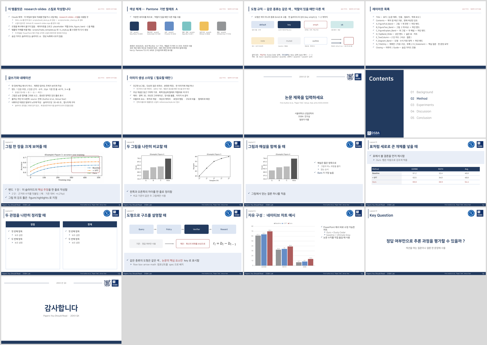

# research-slides

DSBA 연구실의 논문 리뷰(Papers You Should Read)와 연구 발표 자료를 만드는 Claude 스킬과 PowerPoint 템플릿입니다.

- **템플릿**: `assets/research-slides-template.pptx`. 슬라이드 마스터 1개와 이름 있는 레이아웃 12개로 구성되고, 팔레트는 Pantone 기반(Navy Peony, Dusty Cedar 등)입니다.
- **스킬**: `SKILL.md`. Claude가 논문을 읽고, 구성안을 확인받고, figure를 잘라 JSON spec으로 덱을 생성하고, 렌더링해 검토합니다.
- **스크립트**: 사람도 직접 쓸 수 있습니다.



## 설치

Claude Code:

```bash
git clone https://github.com/KimJaehee0725/research-slides ~/.claude/skills/research-slides
pip install -r ~/.claude/skills/research-slides/requirements.txt
```

Claude 앱(Cowork 포함)에서는 이 폴더를 zip으로 묶어 스킬로 추가합니다.

렌더링 검토(`render_check.py`)에는 LibreOffice와 poppler(`pdftoppm`)가 필요합니다.

## 사용

Claude에게 이렇게 요청합니다:

> research-slides 스킬로 이 논문(arXiv:2607.15495) PYSR 리뷰 자료 만들어줘. 영상용이라 노트에 내레이션도 넣어줘.

직접 실행할 때:

```bash
python3 scripts/crop_figure.py paper.pdf --list                  # figure 목록
python3 scripts/crop_figure.py paper.pdf --auto "Figure 2" --out figs/fig2.png
python3 scripts/build_deck.py examples/pysr_example.json out.pptx
python3 scripts/render_check.py out.pptx --out render            # 경고 + contact sheet
```

## 구조

```
SKILL.md                     스킬 진입점 (Claude가 가장 먼저 읽음)
references/
  workflow.md                논문 → 덱 작업 흐름, 구성안 형식
  layouts.md                 레이아웃·역할·좌표·분량 한도 (자동 생성 표 포함)
  spec.md                    JSON spec 스키마
  style.md                   팔레트, 도형 kind, 글쓰기, 이미지 생성 프롬프트
  narration.md               영상 내레이션 대본 규칙
scripts/
  rs_style.py                팔레트·폰트·치수 (단일 기준)
  make_template.py           템플릿 생성 (마스터, 레이아웃, 가이드 슬라이드)
  build_deck.py              spec → pptx
  components.py              box / flow / arrow / highlight / table / chart / math
  crop_figure.py             PDF에서 figure·table 추출
  render_check.py            렌더링과 overflow·범위 검사
  describe_template.py       템플릿 레이아웃 표 출력
assets/
  research-slides-template.pptx
  logos/                     DSBA, 서울대, 대한산업공학회 로고
examples/
  template_showcase.json     템플릿에 들어가는 가이드·예시 슬라이드
  pysr_example.json          PYSR 흐름 예시
```

## 템플릿 수정

디자인은 `scripts/rs_style.py`(색, 폰트)와 `scripts/make_template.py`(레이아웃)에서 바꿉니다.

```bash
python3 scripts/make_template.py            # assets/research-slides-template.pptx 재생성
python3 scripts/describe_template.py        # layouts.md 표 갱신용 출력
```

PowerPoint에서 템플릿을 직접 고치면 스크립트의 정의와 어긋나므로, 고친 내용은 스크립트에 반영합니다.

## 로고

`assets/logos/`의 로고는 DSBA 연구실, 서울대학교, 대한산업공학회의 표장입니다. 연구실 발표 용도로만 사용합니다.
